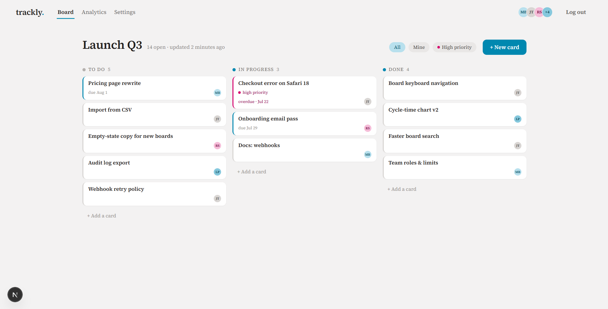
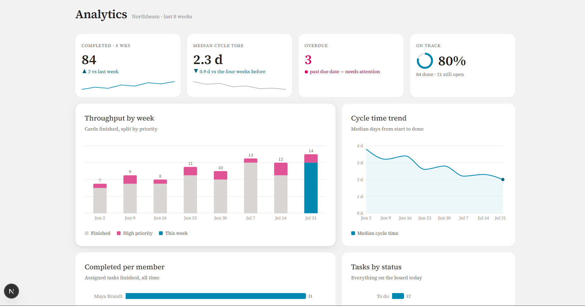
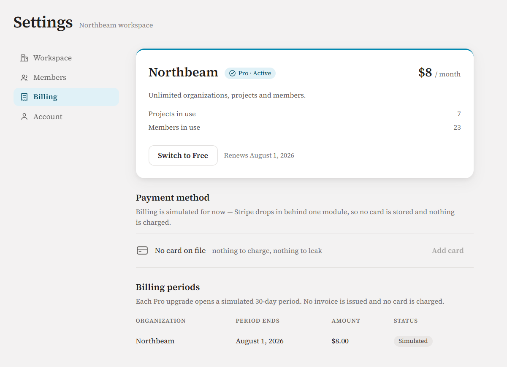

**Project tracking for teams who'd rather be working.**

Trackly is a multi-tenant SaaS where teams track projects and tasks on a fast kanban board, read weekly analytics computed in the database, and manage plans per workspace. The whole product is set in one visual identity: ink on paper, process cyan as the single working accent, magenta reserved for what's genuinely urgent.

---

## Screens

**The board.** Three lanes, drag and drop, priority as a stripe of ink on the card's edge. Overdue cards say so in magenta.



**Analytics.** Four numbers and four charts, all computed in SQL views and scoped by row-level security.



**Settings.** Workspace, members, billing and account in one shell.



## Features

- **Organizations & roles.** Owner / admin / member per workspace, with an org switcher and email invitations (single-use, hashed tokens, 7-day expiry).
- **Kanban board.** Three lanes, native drag & drop, optimistic updates with automatic revert when the server rejects a move. Priority is a stripe of ink on the card's edge. Filters: All · Mine · High priority.
- **Analytics.** Throughput per week split by priority, median cycle time and its trend, tasks by status, per-member completion, and overdue count. All computed in SQL views, rendered with Recharts.
- **Activity feed.** An append-only, per-project log of who did what.
- **Plans & billing.** Free (1 org · 3 projects · 5 members) and Pro (unlimited), enforced server-side. Billing is simulated behind a single module so a payment provider can drop in later without touching the rest of the app.
- **Auth.** Email + password only. Signup, login, password reset, change password, account deletion with confirmation.

## Stack

| Layer      | Choice                                                       |
| ---------- | ------------------------------------------------------------ |
| Framework  | Next.js (App Router) · React · TypeScript strict             |
| Styling    | Tailwind CSS + a hand-rolled design-token system             |
| Database   | Supabase Postgres, Row Level Security on every table         |
| Auth       | Supabase Auth (email/password), sessions in httpOnly cookies |
| Charts     | Recharts                                                     |
| Validation | Zod on every API input                                       |
| Hosting    | Vercel-ready (serverless)                                    |

## Security model

Security is enforced in the database, not the UI:

- **RLS everywhere.** Every table carries row-level-security policies; every query is scoped to organizations the caller belongs to. Helper functions (`is_org_member`, `has_org_role`) run as `SECURITY DEFINER` to avoid policy recursion.
- **Server-verified permissions on every mutation.** Moving a card, deleting a project, changing a plan: each request re-checks membership and role server-side. The client's optimistic UI reverts if the database says no.
- **Sessions in httpOnly cookies** via `@supabase/ssr`, with no tokens in localStorage. Middleware revalidates the JWT on every protected route (`/dashboard`, `/settings`, `/account`, `/api/private/*`).
- **Rate limiting** on login, signup and password reset (5 attempts / 15 min per IP+email) through an atomic, race-free SQL function, with no external service.
- **Generic errors to the client**, detailed errors in server logs. Login never reveals whether an email exists.
- **Analytics views** use `security_invoker`, so the caller's RLS applies and views can't become a cross-tenant side channel.
- **Strict headers**: CSP, `X-Frame-Options: DENY`, `nosniff`, referrer policy, HSTS. The service-role key exists only in server-side code, in audited routes.
- **Plan limits are enforced in API routes** with membership checked first, so outsiders can't probe an organization's counts.

## Getting started

### 1. Prerequisites

- Node 18+
- A [Supabase](https://supabase.com) project

### 2. Environment

```bash
cp .env.local.example .env.local
```

| Variable                        | Where to find it                                    |
| ------------------------------- | --------------------------------------------------- |
| `NEXT_PUBLIC_SUPABASE_URL`      | Supabase → Project Settings → API                   |
| `NEXT_PUBLIC_SUPABASE_ANON_KEY` | Supabase → Project Settings → API (anon / public)   |
| `SUPABASE_SERVICE_ROLE_KEY`     | Supabase → Project Settings → API (service_role, server-only, never exposed) |
| `NEXT_PUBLIC_SITE_URL`          | `http://localhost:3000` in development              |

### 3. Database

Run the migrations in the Supabase SQL editor (or via `psql`), **in order**:

```
supabase/schema.sql                     auth: profiles, rate_limits, signup trigger
supabase/002_saas_core.sql              orgs, members, projects, tasks, activity, subscriptions + RLS
supabase/003_invitations.sql            invitations (hashed tokens)
supabase/004_rate_limit_fn.sql          atomic rate-limit function
supabase/005_app_shell.sql              role-gated deletes, co-member profile reads
supabase/006_analytics.sql              completed_at trigger + analytics views
supabase/007_fix_org_create_returning.sql  org-creation RETURNING visibility
supabase/008_analytics_weekly_detail.sql   weekly priority split + median cycle time
```

In Supabase → Authentication, keep only the **Email** provider enabled, and set your Site URL / redirect URLs.

### 4. Run

```bash
npm install
npm run dev        # development
npm run build && npm start   # production
```

> **Tip: dev feels slow, production doesn't.** Development recompiles each route on first visit and re-renders on every file change; measured warm production responses are ~0.4 s per page and 25 ms for the landing. If the project folder lives inside a synced directory (OneDrive, Dropbox…), move it out. Sync churn on `.next` retriggers the compiler constantly, and it can make a production build fail on a random route.

## Scripts

| Command             | What it does                 |
| ------------------- | ---------------------------- |
| `npm run dev`       | Development server           |
| `npm run build`     | Production build             |
| `npm start`         | Serve the production build   |
| `npm run typecheck` | TypeScript, strict, no emit  |
| `npm run lint`      | ESLint                       |

## Project structure

```
src/
├── app/
│   ├── page.tsx                    landing (marketing)
│   ├── login/ · signup/ · forgot-password/ · reset-password/
│   ├── onboarding/                 create org → invite team
│   ├── dashboard/[orgId]/          app shell: projects, board, analytics
│   ├── settings/                   workspace · members · billing · account
│   └── api/                        auth + private API routes (Zod + session + RLS)
├── components/                     board, modals, charts, topbar, switcher
├── lib/
│   ├── supabase/                   server / browser / admin clients
│   ├── billing.ts                  plans, limits, upgrade (the payment seam)
│   ├── rate-limit.ts · validation.ts · activity.ts · http.ts
└── middleware.ts                   route protection + session refresh
supabase/                           SQL migrations (schema, RLS, views)
```

## Roadmap

- Real payment provider behind `lib/billing.ts`
- Transactional email (invitations currently log to the server console)
- Member management UI (roles, removal)
- WIP limits per lane

## License

Private. All rights reserved.
